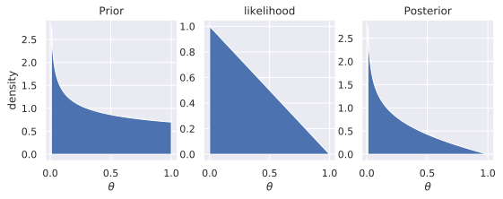
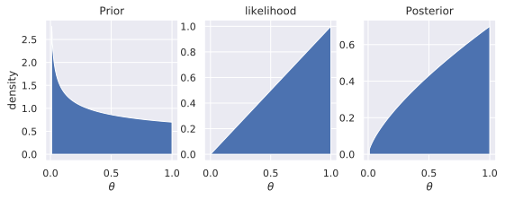
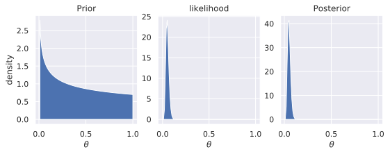
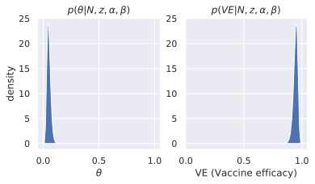

# A Bayesian (re)Analysis of Pfizers COVID19 vaccine data.

This post is inspired by [this post at
r-bloggers.com](https://www.r-bloggers.com/2020/11/a-look-at-biontech-pfizers-bayesian-analysis-of-their-covid-19-vaccine-trial/)
They did the grunt work and reverse engineered [the study
plan](https://pfe-pfizercom-d8-prod.s3.amazonaws.com/2020-09/C4591001_Clinical_Protocol.pdf#page=102)

It uses data from the [press
release](https://www.pfizer.com/news/press-release/press-release-detail/pfizer-and-biontech-conclude-phase-3-study-covid-19-vaccine)
which can be summarized as follows:

 * They use a Beta prior with $a=0.700102$ and $b=1$
 * They use a binomial likelihood:
    - There were 162 COVID19 cases in the control group
    - There were 8 COVID19 in the vaccine group
    - thus $z=8$ and $N=162+8=170$
 * The trial was considered a success if the $2.5\%$ lower of end of the $VE$
   (Vaccine Efficacy) interval exclude 30%.

If you are unfamiliar with the dichotomous distributions (Beta, Bernoulli and
Binomial), then you should read [this](../../dichotomous-distributions) before
continuing, or wing it

It is obvious when there are 8 in one group and 162 in the other group, then the
vaccine is very effective, so while this analysis may seem overkill to conclude
something obvious, I can assure you that what Phizer has send to the FDA is
much longer!, so let's get started.

## Step 0, what do we want to model?

**$VE$ - what we care about**

If we define $\pi_v$ as the probability that a person in the vaccine group
falls ill, and $\pi_c$ as the probability that a person in the control group
falls ill, then $VE$, the vaccination efficacy is defined as:

$$
VE=1 - \frac{\pi_v}{\pi_c}
$$

Lets plug in numbers to help out intuition, let's assume that $\pi_v=4\pi_c$,
for every 4 sick in the control there is 1 sick in the vaccine group, then
$VE=1-\frac{1}{4}=0.75$ thus the Vaccine efficacy is 75%, meaning $\frac{3}{4}$ where
prevented and $\frac{1}{4}$ were not.

**$\theta$ - What we model and measure**

In their study plan they define $\theta$ as follows:

$$
\theta = \frac{1 - VE}{2 - VE}
$$

While this seems like black magic to me, let's try to plug in the definition
for $VE$ into the formula for $\theta$:

<!-- $$ -->
<!-- \begin{aligned} -->
<!--     \theta &= \frac{1 - VE}{2 - VE} \\ -->
<!--     \theta &= \frac{1 - (1 - \frac{\pi_v}{pi_c})} -->
<!--                    {2 - (1 - \frac{\pi_v}{pi_c})} \\ -->
<!--     \theta &= \frac{\frac{\pi_v}{pi_c}} -->
<!--                    {(1 + \frac{\pi_v}{pi_c})} \\ -->
<!--     (1 + \frac{\pi_v}{\pi_c})\theta &= \frac{\pi_v}{pi_c} \\ -->
<!--     (\pi_c + \pi_v)\theta &= \pi_v \\ -->
<!--     \theta &= \frac{\pi_v}{\pi_c + \pi_v} -->
<!-- \end{aligned} -->
<!-- $$ -->
$$
\begin{aligned}
    \theta &= \frac{1 - VE}{2 - VE} \\
    \theta &= \frac{1 - (1 - \frac{\pi_v}{\pi_c})}
                   {2 - (1 - \frac{\pi_v}{\pi_c})} \\
    \theta &= \frac{\frac{\pi_v}{\pi_c}}
                   {(1 + \frac{\pi_v}{\pi_c})} \\
    \theta &= \frac{\frac{\pi_v}{\pi_c}}
                   {\frac{\pi_c+\pi_v}{\pi_c}} \\
    \theta &= \frac{\pi_v}{\pi_c + \pi_v}
\end{aligned}
$$

So $\theta$ is the proportion of people in the vaccine group who got sick,
if $\theta=0.3$ then $30\%$ of the sick were in the vaccine group.

Since $\theta$ is a probability of a binary outcome, we can use distributions
such as $Beta$, $Bernuli$ and $Binomal$ to model it's uncertainly, and then
transform it (and it's uncertainly) back to the $VE$.

There are 3 steps to a Bayesian model, step 1 is defining a prior $p(\theta)$,
which is what we believe before seeing the data, step 2 is defining a
likelihood function ($p(D|\theta)$), which is what we believe about the data
($D$) given $\theta$. 3. We will use Bayes Theorem to get a posterior
$p(\theta|D)$, which is what we believe about $theta$ given the data.

We can use the formula $\theta=\frac{1-VE}{2-VE}$ to convert $VE$ to $\theta$, but
we need to rearrange the formula to be able to convert the $\theta$ to $VE$,
which is how we want to report the result.

$$
\begin{aligned}
    \theta &= \frac{1 - VE}{2 - VE} \\
    \theta(2 - VE) &= 1 - VE \\
    2\theta - VE\theta + VE &= 1 \\
    VE(1 - \theta{}) &= 1 - 2\theta \\
    VE &= \frac{1 - 2\theta}{1 - \theta}
\end{aligned}
$$

## (Optional) Code to help us visualize

The code will not be explained, but what they do is this: 
 * `bayesian_update` takes a prior and likelihood, plots them, and also plots
   the (unnormalized) posterior via via grid approximation (more on how that
   works later).
 * `plot_dist` plots a distribution both on the scale of $\theta$ and on the
   transformed scale of $VE$

```python
import numpy as np
import scipy as sp
import matplotlib.pyplot as plt


theta_to_ve = lambda th: (1 - 2 * np.array(th)) / (1 - np.array(th))


def norm_grid(theta, likelihood):
    norm_factor = ((likelihood[1:] + likelihood[:-1]) / 2).sum() / (theta.shape[0] - 1)
    return likelihood / norm_factor 


def bayesian_update(theta, prior, likelihood):
    fig = plt.figure(figsize=(9, 3))
    fig.subplots_adjust(bottom=0.15)
    posterior = prior * likelihood
    _iter = ((prior, "Prior"), (likelihood, "likelihood"), (posterior, "Posterior"))
    for i, (dist, dist_name) in enumerate(_iter, 1):
        ax = fig.add_subplot(1, 3, i, xlabel=r"$\theta$", title=dist_name,
                             ylabel='density' if i == 1 else '')
        ax.fill_between(theta, dist)
    return fig


def plot_dist(theta, likelihood, mean=None, interval=None, title=("", "")):
    fig = plt.figure(figsize=(6, 3))
    ax_theta = fig.add_subplot(1, 2, 1, xlabel=r"$\theta$", ylabel='density', title=title[0]) 
    ax_ve = fig.add_subplot(1, 2, 2, xlabel="VE (Vaccine efficacy)", title=title[1]) 
    
    # plot densities
    ax_theta.fill_between(theta, likelihood)
    ve = theta_to_ve(theta)
    ax_ve.fill_between(ve[0<ve], likelihood[0<ve])
    
    # add average line and HDI lines
    if mean is not None:
        mean = np.array(mean)
        ax_theta.plot([mean] * 2, [0, max(likelihood[1:-1])], 'k-')
        ve_mean = (1 - 2 * mean) / (1 - mean)
        ax_ve.plot([ve_mean] * 2, [0, max(likelihood[1:-1])], 'k-')
    if interval is not None:
        interval = np.array(interval)
        ax_theta.plot(interval, [0, 0], 'k-')
        ve_interval = theta_to_ve(interval)[::-1]
        ax_ve.plot([max(0, ve_interval[0]), ve_interval[1]], [0, 0], 'k-')
    return fig
```

## Step 1, the prior

The prior that Phizer choose were $Beta(0.700102, 1)$, While this may seem
weirdly specific, let's remember that if $VE$ is less than $0.3$, then the
vaccine is considered ineffective, which is a 'high' bar compared to 'better
than no effect' which is unfortunately common in the NHST framework. Let's
calculate the mean of this prior, and transform it to $VE$, this may give us a
hit to the choice:

$$
\begin{aligned}
E[p(\theta)] &= \frac{\alpha}{\alpha+\beta} \\
             &= \frac{0.700102}{0.700102+1} = 0.4118 \\
E[VE] &= \frac{1 - 0.4118}{2 - 0.4118} = 0.30
\end{aligned}
$$

So they assume that vaccines which are good enough to enter a phase 3 trial will
on average have a $VE$ of $30\%$, the sample size of the prior is
$\alpha+\beta$ which is 1.7, so we should expect the prior to be very broad.


Let's plot it, we use the `plot_dist` function to plot the distribution of
$\theta$ to the left, we convert $\theta$ to $VE$ by using the formula $VE =
\frac{1 - 2\theta}{1 - \theta}$ ant plot it on the right:

```python
alpha, beta = 0.700102, 1
theta = np.linspace(0, 1, 101)
prior = sp.stats.beta(alpha, beta)
fig = plot_dist(theta, prior.pdf(theta), prior.mean(),
                (prior.cdf(0.025), prior.sf(0.025)),
                [f"p(\\theta|{alpha}, {beta})", f"p(VE|{alpha}, {beta})"]) 
```


And it is very broad given credibility to all values of $\theta$ between 0 and
1, but skews towards 0.

## Step 2, the likelihood

### Side quest - Bayesian Updating
Before we calculate the likelihood of the data, let's try to see how the prior
changes if 1 person from each group fell ill. We use the Bernoulli likelihood
to simulate a 'draw', the Bernoulli likelihood function is a triangle, because 
$p(1\mid\theta)=\theta$ (hint: like $y=x$) and $p(0\mid\theta)=1-\theta$ (hint:
$y=1-x$)

Here is the plot if we had only 1 data point and it was 0 (from the control),
on the left we have the prior (as above), in the middle we have the triangle
shaped Bernoulli likelihood, and on the right we have the unnormalized
posterior:

```python
bayesian_update(theta, prior, sp.stats.bernoulli.pmf(0, theta))
```



If it looks like the left and middle was multiplied together and
produced the right one, then that's because that's exactly what happened, why?

Here we have Bayes theorem with Bernoulli likelihood:

$$
p(\theta|z) = \frac{p(z\mid\theta)p(\theta)}{p(z)}
$$

Notice that the denominator does not depend on $\theta$ and can therefor be
viewed as a (very hard to compute) normalizing constant. If we remove it, we
screw up the scale on the y-axis, but the shape remains, so the unnormalized
posterior (which is not a proper pdf because it does not sum to 1) is:

$$
p(\theta|z) \propto p(z\mid\theta)p(\theta)
$$

Which is exactly how we created the right figure, let's try to see the shape of
the posterior if a vaccinated person had fallen ill:

```python
bayesian_update(theta, prior, sp.stats.bernoulli.pmf(1, theta))
```



If this was all the data we had, then because we have a very weak prior, we
would end up believing that the vaccine most likely does not work, though the
distribution is very broad, so we are not very confident in this assertion.

### likelihood of the actual data

We assume that data is binomial distributed, with parameters $z=8$, $N=170$,
and $p=\theta$. We can then plot how likely this data is for different values of
$\theta$, $p(z,N\mid{}\theta)$, is the likelihood of the data ($z$ and $N$)
given $\theta$, the data is the data, so we are not interested in how $z$ and
$N$ could have been otherwise, we are interested in how likely they are given
different values of $\theta$, so even though we are conditioning on $\theta$
the likelihood is still a function of $\theta$. Let's try to plot the
likelihood for different values of $\theta$ and $VE$:

```python
z, N = 8, 170
likelihood = sp.stats.binom.pmf(z, N, theta)
likelihood = norm_grid(theta, likelihood)
title =  [f"$p(N={N},z={z}\\mid\\theta)$", f"$p(N={N},z={z}\\mid{{}}VE)$"]
fig = plot_dist(theta, likelihood, title=title)
```


In statistics, the uncertainly of a distribution is tied to the sample size, 
Because the likelihood has a sample size of 170 where the prior has one of 1.7,
the likelihood is much narrower than the prior.

## Step 3, the posterior

There are a few ways to get a posterior from a prior and a likelihood, 3 popular methods include:

1. Use sampling.
   * This is what modern Bayesians does, unless they have very simple models like
     this one.
2. Use grid approximation, as we did with the Bernoulli example.
   * This is excellent for teaching purposes, because it's intuitive, but in
     practice this only works for models with very few parameters,
3. Exploit the fact that the priors are conjugated, this we will also do.
   * This is super cool, and easy when you know the solution, but only works for
     small models and a small subset of prior-likelihood combinations.

### Getting the posterior via grid approximation
As previous we simply multiply the prior grid vector with the likelihood grid vector:

```python
fig = bayesian_update(theta, prior.pdf(theta), likelihood)
```



Because there is much less certainly in the likelihood estimate, than the
prior, the posterior is dominated by the likelihood, to the point where it is
almost indistinguishable from the likelihood.

<!-- Grid approximation is simply the act of drawing a grid of parameters, such as  -->
<!-- 101 $\theta$ samples from 0 to 1 in increments of 0.01, and then evaluate prior -->
<!-- $p(\theta)$ and the likelihood $p(N,z\mid\theta)$ at all these points. The -->
<!-- product of these two 'likelihood vectors' would then have the shape of the -->
<!-- posterior because: -->
<!--  -->
<!-- $$ -->
<!-- p(\theta\mid{}N,z)=\frac{p(N,z\mid\theta)p(\theta)}{p(N,z)} \\ -->
<!-- p(\theta\mid{}N,z)=\frac{p(N,z\mid\theta)p(\theta)}{p(N,z)} -->
<!-- $$ -->

<!-- Since $p(N,z)$ does not depend on $\theta$ it can be viewed as the -->
<!-- normalization constant that makes the sum of the two vectors sum to 1, why 1?, -->
<!-- because the definition of a probability density function (which is what the -->
<!-- posterior is) is a function who's integral is 1. In any case, $p(N,z)$ is a -->
<!-- constant, so if we plot $p(N,z\mid\theta)p(\theta)$ then it will have the same -->
<!-- shape as the real posterior. -->

### Getting the posterior via conjugation
**TLDR:** The posterior of the Binomial likelihood $p(N,z\mid\theta)$ with Beta
prior $p(\alpha,\beta)$ is this Beta distribution $p(z+\alpha,N-z+\beta)$

Here we will use the 'conjugation trick' to analytically derive the posterior
for our Beta-Binomial model.

We start with Bayes Theorem:

$$
p(\theta|z,N) = \frac{p(z,N\mid\theta)p(\theta)}{p(z,N)}
$$

Then we plug in the definition for the Binomial likelihood and Beta prior:

$$
p(\theta|z,N) = {N \choose k}\theta^z(1-\theta)^{N-z} % likelihood
                 \frac{\theta^{\alpha-1}(1-\theta)^{\beta-1}}{B(\alpha,\beta)}
$$

That's ugly, let's rearrange. So we have the $\theta$ stuff in the numerator,
and the data stuff in the denominator

$$
p(\theta|z,N) = \frac{\theta^z(1-\theta)^{N-z}\theta^{\alpha-1}(1-\theta)^{\beta-1}}
                     {B(\alpha,\beta){{N \choose k}}^{-1}}
$$

Let's collect the powers in the numerator

$$
p(\theta|z,N) = \frac{\theta^{z+\alpha-1}(1-\theta)^{N-z+\beta-1}}
                     {B(\alpha,\beta){{N \choose k}}^{-1}}
$$

Here comes the conjugation shenanigans. If you squint, the top of the distribution looks like
the top of a Beta distribution:

$$
\begin{aligned}
\alpha'&= z+\alpha \\
\beta'&= N-z+\beta \\
p(\theta|z,N) &= \frac{\theta^{\alpha'-1}(1-\theta)^{\beta'-1}}
                     {B(\alpha,\beta){{N \choose k}}^{-1}}
\end{aligned}
$$

Let's continue the shenanigans, since the numerator looks like the numerator of
a beta distribution, we know that it would be a proper beta
distribution if we changed the denominator like this:

$$
\begin{aligned}
p(\theta|z,N) &= \frac{\theta^{\alpha'-1}(1-\theta)^{\beta'-1}}
                     {B(\alpha',\beta')} \\
p(\theta|z,N) &= \frac{\theta^{z+\alpha-1}(1-\theta)^{N-z+\beta-1}}
                     {B(z+\alpha,N-z+\beta)}
\end{aligned}
$$

And there we have it, a normalized posterior of $\theta$, let's plot it to make
sure it looks like the one we got via grid search:

```python
alpha_prime = z + alpha
beta_prime = N - z + beta
posterior = sp.stats.beta(alpha_prime, beta_prime)
title = (r"$p(\theta|N,z,\alpha,\beta)$",  r"$p(VE|N,z,\alpha,\beta)$")
fig = plot_dist(theta, posterior.pdf(theta), title=title)
```



It looks like the grid one, so we did not mess up!

Now we can finally ask the original question, does the $97.5\%$ lower interval
exclude $VE=30\%$, of course you can use your eyes, and see that the transformed
posterior over $VE$ is far away from $0.3$, what we want is the $\theta$
corresponding to a CDF of 97.5%, the PPF function is the inverse of the CDF, so
let's use it 

```python
>>> theta = posterior.ppf(0.975)
0.08799073744782082
``` 

Now we have $\theta_{2.5\%} = 0.088$, we can transform that with the formular we derived in the beginning

$$
VE_{2.5\%} = \frac{1 - 2\theta_{2.5\%}}{1 - \theta_{2.5\%}} 
           = \frac{1 - 2\times{}0.088}{1 - 0.088} = 0.90
$$

```python
>>> theta_to_ve(theta)
0.9035199081184918
```

So there is a $97.5\%$ chance that $VE$ is at least $0.9$

What's the chance that it's actually worse than $30\%$, remember that
corresponded to $\theta=0.4118$, well that's the area between $0.4118$ and 1,
the survival function is defined as 1-cdf, so let's evaluate it at $0.4118$

```python
>>> posterior.sf(0.4118)
1.1102230246251565e-16
```

Which returns $1.1\times10^{-16}$, so we are very sure that $VE>0.30$


## Compare to the moderna vaccine

According to [modernas press
release](https://investors.modernatx.com/news-releases/news-release-details/modernas-covid-19-vaccine-candidate-meets-its-primary-efficacy)
They had 5 ill in the vaccine group and 90 in the control, they claim a $VE$ of
94.5%... 


### Moderna Frequencist analysis

Since Moderna are not Bayesian, their analysis is very simple, they first
find the maximum likelihood for $\theta$

$$
\theta_{mle} = E_{mle}[p(N,z\mid\theta=\frac{5}{95})=\frac{5}{95}\approx{}0.945
$$

In python, call the function $Binom(z,N=95,p=\frac{5}{95})$ with $z=[0, 1, ...,
95]$, and you find, that $z=5$ is the one that is must likely value.

```
(95 - sp.stats.binom.pmf(list(range(0, 96)), 95, 5/95).argmax()) / 95
>>>0.9473684210526315
```

Then they ask, how likely is this data or data more extreme if we assume
$\theta_{null}=0.4118$, and yes you heard me right, the question is how could
the data be different if $\theta$ is fixed... Why you want to fix the
data and let $\theta$ be free to vary... That seems absurd!

$$
p_{null} = \sum_{z=0}^{5} Binom(z|N,\theta_{null})
$$

Which in python is:
```
>>>sp.stats.binom_test(5, 95, p=0.4118)
1.6653726359377186e-15
```

Thus, they reject the Null hypothesis that $\theta=0.3$... And because there
were only two hypothesis in play ($\theta_{null}$ and $\theta_{mle}$), we now
conclude that $\theta$ is 0.945... The logic overwhelms me!


### Bayesian Comparison

Let's do a Bayesian analysis using the Pfizer prior to compare the two distribution of $VE$

The posterior of the Moderna vaccine is $Beta(5+\alpha,90+\beta)$, let's plot
it and the Pfizer vaccine together (here follows a lot of python code to make
the plot pretty):

```python
theta = np.linspace(0, 1, 1001)
mean_like = lambda model: model.pdf(model.ppf(0.5))

posterior_pfizer = sp.stats.beta(z + alpha, N - z + beta)
posterior_moderna = sp.stats.beta(5 + alpha, 95 - 5 + beta)

fig = plt.figure(figsize=(8, 4))
ax_theta = fig.add_subplot(1, 2, 1, xlabel=r"$\theta$", ylabel='density', title='Posterior',
                           xlim=(0, 0.2))
ax_ve = fig.add_subplot(1, 2, 2, xlabel="VE (Vaccine efficacy)", title='Posterior', xlim=(0.8, 1)) 
ax_ve.get_yaxis().set_visible(False)

ve = theta_to_ve(theta)
for posterior, company in ((posterior_pfizer, 'Pfizer'), (posterior_moderna, 'Moderna')):
    ax_theta.fill_between(theta, posterior.pdf(theta), label=company, alpha=0.5)
    ax_theta.plot([posterior.mean()] * 2,  [0, mean_like(posterior)], 'w-')
    ax_theta.legend()

    ax_ve.fill_between(ve[0<ve], posterior.pdf(theta)[0<ve], label=company, alpha=0.5)
    ax_ve.plot([theta_to_ve(posterior.mean())] * 2,  [0, mean_like(posterior)], 'w-')
    ax_ve.legend()
```


Looking at the left $\theta$ plot, both the posteriors are plotted half
transparent which makes it apparent that the moderna vaccines skews slightly further towards 1
than the Pfizer vaccine. The white bars are the mean (not mode!), and seems to
be to the right of the mode, suggesting that the mean is above the maximum
likelihood, because the distribution skew right, This means that on average, we
should expect the moderna vaccine to be a little worse than what the press
release says. 

**Intuition:** To get an intuition for this, imagine 4 guys 1 boxer and 3
regular dudes, if a random one punches you then it will most likely not hurt
that much, but if you are hit 100 times each time by a random person from that
set, then you are gonna be ruffed up much more than if you were punched 100 of
the most likely person from the set.

This is why it's important to think in distributions and not point estimates!,
because the mode is only descriptive for symmetrical distributions!, and even
so, the spread matters a lot too!

Let's try to get the 95% HDI of the two vaccines:

```python
>>> hdi_pfizer = posterior_pfizer.ppf(0.025), posterior_pfizer.isf(0.025)
>>> hdi_pfizer
(0.023194023204048876, 0.08799073744782082)
>>> theta_to_ve(hdi_pfizer[::-1])
array([0.90351991, 0.97625524])

>>> hdi_moderna = posterior_morderna.ppf(0.025), posterior_morderna.isf(0.025)
>>> hdi_moderna
(0.021457425697193788, 0.1135275194746207)
>>> theta_to_ve(hdi_moderna[::-1])
array([0.8719334 , 0.97807206])
```

So we are 95% sure that $VE_{Pfizer}$ is between $0.90$ and $0.97$, and
$VE_{moderna}$ is between 0.87 and 0.98... This also shows how deceptive
Frequentist statistics (or science communication?) can be, when 0.945 is the
maximum likelihood, few people would intuitively conclude that it may be 3.5%
higher or it may be 7.5% lower!, using the mean of the distribution (0.937) the
95% interval is 4% higher and 6% lower, this is better, but looking at
the posterior (the figure) is even better, the distribution for $VE$ skews
left, and therefore the left tail spans a larger area than the right tail.

The mean of the two posteriors are:

```python
>>> theta_to_ve(posterior_pfizer.mean())
0.9466251411042945

>>> theta_to_ve(posterior_morderna.mean())
0.9373615164835165
```

In summary:

 * $E[VE_{Pfizer}]=0.95$ (95% HDI $[0.90, 0.97]$)
 * $E[VE_{Moderna}]=0.94$ (95% HDI $[0.87, 0.98]$)

Is $E[VE_{Pfizer}]$ statistically significantly higher than $E[VE_{Moderna}]$?, what
kind of stupid question is that! You have the posterior, which tells you
everything you need to know about efficacy, decide for yourself if the
difference matter to you, for me, they both look amazing, and I am tired of
working from home, so whichever one my doctor has is the one I will take!


