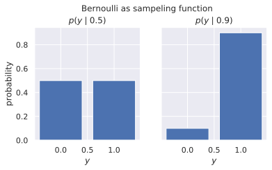
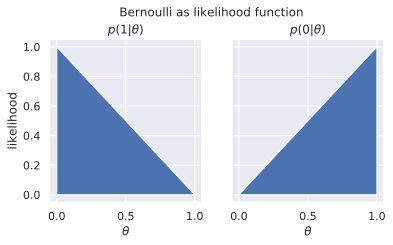
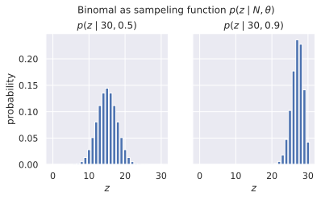
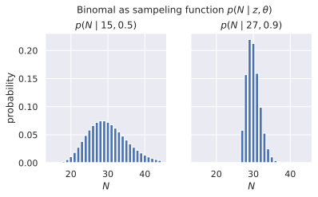
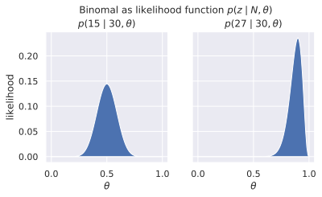
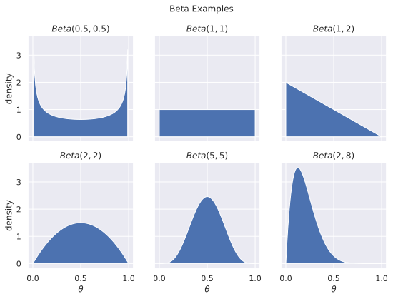

# Dichotomous Distributions
Here we will go trough the 3 most common dichotomous distributions, the are all
parameterized such that $\theta$ is the probability parameter.

## The Bernoulli Distribution
The Bernoulli distribution (shown below) describes one
occurrence of a random event with probability $\theta$ (conventionally the parameter is
$p$), thus a fair coin would be described as having $\theta=\frac{1}{2}$
probability of landing heads up ($y=1$).

$$
    p(y\mid\theta) = \theta^{y}{(1-\theta)}^{1-y}
$$

While this looks complicated remember that $\theta^0=1$, so for a biased coin
with $\theta=0.9$, the probability of head ($y=1$) and tail ($y=0$) are:

$$
\begin{split}
    p(y=1\mid\theta=0.9) &= \theta^{y}{(1-\theta)}^{1-y} \\
                        &= 0.9^{1}{(1-0.9)}^{1-1} = 0.9^1 - 0.1^0 = 0.9 \\
    p(y=0\mid\theta=0.9) &= \theta^{y}{(1-\theta)}^{1-y} \\
                        &= 0.9^{0}{(1-0.9)}^{1-0} = 0.9^0 - 0.1^1 = 0.1
\end{split}
$$

### Bernoulli as a sampling function
When viewed as a function of $y$ with fixed $\theta$ is it a proper density
function that sums to 1, this is how it is commonly used in frequent it statistics

Below you can see the Bernoulli sampling function for a fair coin
($\theta=0.5$) and an unfair coin ($\theta=0.9$)

### Bernoulli as a likelihood function
When viewed as a function of $\theta$ with fixed $y$, we call it the Bernoulli
likelihood function, likelihood functions often do not sum to one, but are
rescued by the denominator of bayes theorem ($p(y)$), for example 
$\int_{0}^{1} p(1\mid\theta)=0.5$ but there are also 2 possible values of $y$ so
$p(y=1)=0.5$

Below you can see the Bernoulli likelihood function for a heads ($y=1$) and
tails ($y=0$)

## The Binomial Distribution
The Binomial distribution (shown below) is the sum of N Bernoulli
experiments, like flipping the coin N times. 

$$
\begin{split}
    p(z\mid{}N,\theta) = {N \choose z} \theta^{z}{(1-\theta)}^{N-z} \\
    \text{where, ${N \choose{} k} = \frac{n!}{k!(n-k)!}$}
\end{split}
$$

Lets imagine I have a slightly biased coin with $\theta=0.6$ and flip it
two times. There are then 4 combinations of things that could happen: $\{HH,
HT, TH, TT\}$, however two of these combinations result in the same outcome,
because both $HT$ and $TH$ results in one head ($z=1$). This is what is
captured in the ${N \choose z}$ (pronounced "N choose z") part of the equation. To
make it more intuitive please look at the Table below and it's description below:

| $z$ | outcomes | $N \choose z$     | $\theta^z(1-\theta)^N$ $^-$ $^z$ | $p(z\mid\theta,N)$   |
------|----------|-------------------|----------------------------------|----------------------|
|  0  | $TT$     | $2!/(0!(2-0)!)=1$ | $0.6^0(1-0.6)^2=0.16$            | $1\times0.16 = 0.16$ |
|  1  | $TH,HT$  | $2!/(1!(2-1)!)=2$ | $0.6^1(1-0.6)^1=0.24$            | $2\times0.24 = 0.48$ |
|  2  | $HH$     | $2!/(2!(2-2)!)=1$ | $0.6^2(1-0.6)^0=0.36$            | $1\times0.36 = 0.36$ |

Binomial distribution for two rolls of a biased coin with $\theta=0.6$. Each
row calculates the probability of getting $z$ heads (column 1). Column 2 shows
how many different coin flips that can generate this outcome, Column 3: ${N
\choose z}$ calculate the length of the set from column 2, Column 4 calculates
the probability of one of the outcomes. Finally Column 5 calculates the
probability of $z$, which is the Bernoulli probability of 1 outcome times the
number of possible outcomes. Notice that of the 4 possible outcomes $HH$ is the
most likely with $p=0.36$, vs only $0.24$ for $HT$ or $TH$. However because there
are two ways get $z=1$, it becomes the most likely outcome, because
$2\times{}0.24 >1\times{}0.36$

### Binomial Sampling Function
the sampling function calculates the probability of observing $z$ given $N$ and
$\theta$. The question the sampling function answers is: given some value of
$\theta$ (and $N$), how probable is the sample ($z$). 

Below you can see the Binomial sampling function for a fair coin
($\theta=0.5$) and an unfair coin ($\theta=0.9$) both flipped $N=30$ times.

**Note:** An alternative sampling function exists $p(N\mid{}z,\theta)$ where the
coin is flipped until $z$ heads are achieved, thus given $z$ and $\theta$ how
probable is is we stop after $N$ throws. This gives rise to the dreaded
'stopping criterion' in Frequentist statistics because the two sampling
methods can give different p-values for the same observed data.

This other sampling function is:

$$
    p(N\mid{}z,\theta) = \frac{z}{N} {N \choose z} \theta^{z}{(1-\theta)}^{N-z}
$$

### Binomial Likelihood Function
When viewed as a function of $\theta$ with fixed $N$ and $z$ it's the
likelihood of the data ($z$ and $N$) given $\theta$.

Below you can see the Binomial likelihood function for two datasets $z=15,
N=15$ and $z=27, N=30$

**Note:** An alternative likelihood function exists $p(N\mid{}z,\theta)$,
however since $N$ and $z$ are fixed this does not influence Bayesian inference,
it will simply rescale the y-axis by the constant $\frac{z}{N}$.

## The Beta Distribution

The beta distribution is a common distribution in Bayesian statistics, I like
to think of it as a binomial distribution with continuous $N$ and $z$. So it's
like flipping a special coin, where I can flip 5.7 times getting 2.7 heads.
This may seem preposterous, but it's very nice for priors, if we think that
$\theta$ is around 0.9, then we could imagine being as sure as $z=1$ $N=10$,
but what if we were only half as sure, well then we divide by two: $z=0.5$
$N=5$. The beta distribution is parameterized by $\alpha$ and $\beta$, with
$\alpha$ being the number of zeros and $\beta$ being the number of ones. The
weight of the prior (read sample size, ala $N$) is $\alpha+\beta$.

The Beta Distribution is defined as:

$$
\begin{split}
    Beta(\theta|\alpha,\beta)=\frac{\theta^{\alpha-1}{(1-\theta)}^{\beta-1}}
                                    {B(\alpha, \beta)} \\
    \text{Where }B(\alpha, \beta) = \frac{\Gamma(\alpha+\beta)}{\Gamma(\alpha)\Gamma(\beta)} \\
    \text{Where }\Gamma \left( x \right) = \int\limits_0^\infty {s^{x - 1} e^{ - s} ds}
\end{split}
$$

While this seems even more scary than the Binomial function, if you squint, you
can see that the numerator looks like a Binomial if we change $\alpha-1$ to $z$ and
$\beta-1$ to $N-z$, and if that's true then the denominator $B(\alpha, \beta)$ can
be 'loosely' interpreted:

$$
B(\alpha,\beta) \simeq {\alpha+\beta-2 \choose \alpha-1}^{-1}
$$

Well if that intuition is true, then $\alpha=2,\beta=1$ should look like:

$$
\begin{split}
    z=\alpha-1=2-1=1 \\
    N=\beta-1+z=1-1+1=1
\end{split}
$$

Which is a Bernoulli, and it does look very similar (see figure below), with the
caveat that the beta distribution has twice as steep a slope, because it is
$p(\theta\mid\alpha,\beta)$ and therefore is a proper density function even
when seen as a function of $\theta$

The most common theta prior is $Beta(1,1)$ because it's uniform over the whole
range of $\theta$, but betas with other values are also fine.

To get a feel for the Beta function, here are some examples

