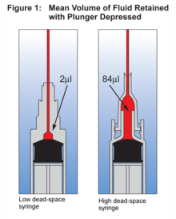

# Pfizer Vaccine - Dosages and dead space

We have heard many wonderful tales of skilled (and well equipped) nurses
drawing a 6th or even 7th dosage from the vial, what kinda of sorcery is this?
And how many dosages are there in a Pfizer vaccine?

According to [This
article](https://www.theverge.com/2020/12/19/22188456/pfizer-biontech-vaccine-extra-antivirus-moderna)
The are 450µL in a vial, which is diluted in 1.8µL saline water, this gives a
final volume of 2250µL, one dosage is 300µL, so a naive calculation is:

$$
\frac{2250\mu{}L}{300\frac{\mu{}L}{doses}} = 7.5 doses \Rightarrow 7 doses
$$

**Question:** So There is 7.5 dosages in a vial, why can some only draw 5 and others up to 7?

**Answer:** Because there is a small dead volume in syringes, this volume
depends on the quality of the syringe. Here is an image stolen from
[https://www.slowboring.com/p/dead-space](https://www.slowboring.com/p/dead-space)

Let's redo the math with the 84µL dead space syringe which is what Pfizer
expects to be used:

$$
\frac{2250µL}{300\frac{\mu{}L}{dose}+84\frac{\mu{}L}{dose}}=5.86 dose \Rightarrow 5 doses
$$

So that gives the 5 doses that we all expected, let's try to redo the math with the 2µL syringe

$$
\frac{2250µL}{300\frac{\mu{}L}{dose}+2\frac{\mu{}L}{dose}}=7.45 dose \Rightarrow 7 doses
$$

So with this vial we can potentially draw 7 doses, which is what Denmark is doing, how come most places are only banking on 6 doses?

## Volume Left in Vial

I have two guesses.

1. They have slightly worse syringes, a dead space of 22µL will make the 7th
   dose impossible to draw
2. It requires highly skilled personal to draw the 7th dose

Let's calculate the volume in the vial after 5 or 7 draws.

5 draws 84µL dead volume:

$$
2250µL - 5dose \times (300\frac{\mu{}L}{dose} + 84\frac{\mu{}L}{dose}) = 330µL
$$

So according to Pfizer they expect that nurses can draw 5 vials with only 330µL
left (that's 0.3ml!) - there is a reason we call this skilled labor!

7 draws 2µL dead volume:

$$
2250µL - 7dose \times (300\frac{\mu{}L}{dose} + 2\frac{\mu{}L}{dose}) = 136µL
$$

So here there are 136µL left in the vial, for reference a drop of water is about
50µL, so if you have 2 drops of water stuck to the lid and one to the bottom
of the vial, game over, if your hands shake more than the diameter of a water
droplet, game over.

The fact that some can draw this 7th dose fills me with tremendous pride! Not
all heroes wear cape, but a some wear scrubs or lab coat.

