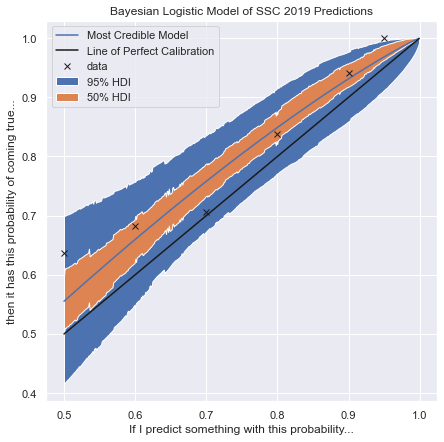

# Scott Alexander 2019 Predictions - Part 2

This is the second post in a series about prediction and calibration.

In [the previous post:](../../blog/bayesian-prediction-calibration-1/) we learn
what a likelihood function is, and used it to evaluate predictions

We will now Make a Bayesian calibration model, in two steps:

1. Make a Bad Bayesian Model using the Normal distribution as a likelihood
   function for the data
2. Make a Good Bayesian Model where we rescale Scotts Predictions to the
   logit scale, and use the Bernoulli likelihood

**Warning**

When we do Bayesian inference, we assume a model, and then calculate the
uncertainly given the data **AND** the model, 

Paraphrasing Richard McElreath: "Models are like Golems, they are awesome, but
sometimes the wreck Prague"

So for pedagogical we will build 2 models, one which is bad on purpose, to show
how easy it is to mess up.

**No game theory for you**

You may be
tempted to predict everything with 50%, suspecting that would lead to perfect
calibration, this will however give the models we explore here very little data
to fit your 'prediction regression coefficient' and make the model fall back on
the broad prior, yay go bayes!, so the only way to become well calibration is
to assign probabilities which are congruent with the frequency of outcome!

**Load data and libraries**

First we import all the python libraries we need (`pymc3` is a Bayesian modelling
library and `arviz` is a library for visualizing posterior and prior
distributions.)


```python
%matplotlib inline
import numpy as np
from scipy.special import expit, logit
import matplotlib.pyplot as plt
import pymc3 as pm
import arviz as az
```

Then we code Scott Alexanders prediction data coded as \[Guess, Outcome\].

Because outcomes is what we want to "predict" we put that in the $y$ variable,
and put guess in the predictor variable $x$


```python
data = np.array((
    [[0.5, 1]] *  7 + [[0.5, 0]] * 4 +
    [[0.6, 1]] * 15 + [[0.6, 0]] * 7 +
    [[0.7, 1]] * 12 + [[0.7, 0]] * 5 +
    [[0.8, 1]] * 31 + [[0.8, 0]] * 6 +
    [[0.9, 1]] * 16 + [[0.9, 0]] * 1 +
    [[0.95, 1]] * 5 + [[0.95, 0]] * 0
))
y = data[:, 1]
X = data[:, 0]
```

## Let's wreck Prague

So how do we evaluate how good a predictor someone are?, we make a model and
inspect it's posterior of course, we will end up making a Bayesian logistic
models, but we will first create a very bad and wrong models to get our
intuition going.

All models are basically: We have some $y$ (the response variable), which we
want to predict from some $x$ (the predictors)

Our $y$ is 1 when the prediction turned out correct and 0 otherwise, let's make
a linear regression, where we try to predict $y$ from Scotts guesses ($x$)

We will use the 'classical' linear model:

$y = ax + b + \epsilon$

Where $a$ is the slope, $b$ the intercept and $\epsilon$ is the residual error
not explained by the model.

Because we are Bayesians we will have priors distributions on $a$ and $b$,
These will reflect what we believe before seeing the data

What should the prior for $a$ and $b$ be?, starting with $b$, which describes how
a person systematically predicts to high or to low, let's assume that it is
normal distributed around $0\pm0.1$:

$b \sim N(0, 0.1)$

$a$ is the slope, most people are bad predictors, so we set a broad prior around $1$

$a \sim N(1, 0.5)$

Finally no model is perfect, so we need a distribution for the residual error
$\epsilon$, we call this function the likelihood function because it predict how
likely our data is, if there is very little residual error, the likelihood
function will be tall, making the data very likely, where if there is a lot of
residual error, the likelihood function will be broad, $\sigma$ of this
likelihood function also needs a prior, which we choose (for convenience) to be
uniform, meaning any value in a range is equally likely:

$\sigma \sim U(0, 100)$

$\epsilon \sim N(ax + b, \sigma)$

Putting it all together in a Full Model specification:
$$
\begin{aligned}
    a &\sim N(1, 0.5) \\
    b &\sim N(0, 0.1) \\
    \sigma &\sim U(0, 100) \\
    \epsilon &\sim N(0, \sigma) \\
    \hat{y} &= ax + b + \epsilon \\
\end{aligned}
$$

The above model can be simplified $\epsilon$ is the residual error, but is can
also be seen as the uncertainly of our estimate of $y$:

$$
\begin{aligned}
    a &\sim N(1, 0.5) \\
    b &\sim N(0, 0.1) \\
    \sigma &\sim U(0, 100) \\
    \hat{y} &\sim N(ax + b, \sigma) \\
\end{aligned}
$$

Which is how models usually are implemented in most probabilistic programming languages

We then create this model in PyMC3, notice every line in the 'Full Model' is one line of code

* 3 lines with priors, 
* 1 line model with specification
* 1 line with the likelihood of the data


```python
with pm.Model() as bad_model:
    # priors
    a = pm.Normal('a', mu=0, sigma=0.5)
    b = pm.Normal('b', mu=0, sigma=0.5)
    sigma = pm.Uniform('sigma', 0, 10)
    
    # model
    y_est = a * X + b
    
    # likelihood
    y_like = pm.Normal('y_like', mu=y_est, sigma=sigma, observed=y)
    
```


```python
pm.model_to_graphviz(bad_model)
```


    

    


The above graph shows how the likelihood of the data ($\hat{y}$) depends on 3
variables, and we have 109 observations (Scotts predictions), so everything seems
fine, If the lines did not connect, then we had messed something up in the
model specification.

Sanity check 1, prior predictive check, let's draw 100 random samples from our
prior to see what the model believes before seeing data


```python
with bad_model:
    prior_checks = pm.sample_prior_predictive(100)

fig = plt.figure(figsize=(7, 7))
ax = fig.add_subplot(111, xlabel='If I predict something with this probability...',
                     ylabel='then it has this probability of coming true...', 
                     title='Bayesian Linear Model of SSC 2019 Predictions')
ax.set_ylim(0, 1)
xs = np.linspace(0, 1, 1001)  # grid with 1001 points between 0 and 1
for a, b in zip(prior_checks["a"], prior_checks["b"]):
    ys = a + b * xs
    ax.plot(xs, ys, c="k", alpha=0.4)

```


    

    


There are many things wrong with this prior predictive check, first of all, the
model thinks that sometimes the slope of $a$ is negative, and sometimes $b$ is
outside the range 0-1 which is impossible, some of these things can be rescued
by fancy priors, but we will not pursue this. Let's see what the model believes
after looking at data

We do this by 

1. drawing samples from from the models posterior, which is the joined
   distribution of all the parameters ($a$ and $b$).
2. plotting the distribution of these parameters
<!-- 3. performing a posterior predictive check to see what the model believes -->


```python
with bad_model:
    bad_trace = pm.sample(2000)
az.plot_posterior(bad_trace)
```

    Auto-assigning NUTS sampler...
    Initializing NUTS using jitter+adapt_diag...
    Multiprocess sampling (4 chains in 4 jobs)
    NUTS: [sigma, b, a]


<div>
    <style>
        /* Turns off some styling */
        progress {
            /* gets rid of default border in Firefox and Opera. */
            border: none;
            /* Needs to be in here for Safari polyfill so background images work as expected. */
            background-size: auto;
        }
        .progress-bar-interrupted, .progress-bar-interrupted::-webkit-progress-bar {
            background: #F44336;
        }
    </style>
  <progress value='12000' class='' max='12000' style='width:300px; height:20px; vertical-align: middle;'></progress>
  100.00% [12000/12000 00:13<00:00 Sampling 4 chains, 0 divergences]
</div>


    Sampling 4 chains for 1_000 tune and 2_000 draw iterations (4_000 + 8_000 draws total) took 24 seconds.
    /Users/jcr/.pyenv/versions/3.7.5/lib/python3.7/site-packages/arviz/data/io_pymc3.py:91: FutureWarning: Using `from_pymc3` without the model will be deprecated in a future release. Not using the model will return less accurate and less useful results. Make sure you use the model argument or call from_pymc3 within a model context.
      FutureWarning,


    array([<matplotlib.axes._subplots.AxesSubplot object at 0x12792ab10>,
           <matplotlib.axes._subplots.AxesSubplot object at 0x127cbdf50>,
           <matplotlib.axes._subplots.AxesSubplot object at 0x127cf68d0>],
          dtype=object)


    

    


We then use a (marginalized) posterior plot to see how our 3 parameters are
distributed, we would expect $a$ to be close to 1 and $b$ to be close to 0, but
that is now at all what we see, $a$ is much less than 1 and $b$ seems to be
between 0.2-0.4, this means that our model thinks that Scott Alexander is a bad
predictor, why does it think that?, let's start by doing a posterior predictive
check, to visualize what the model believes.

We do this by drawing $a$ and $b$ 100 times from the posterior and then drawing
100 lines of $\hat{y}=ax+b$


```python
# fig, ax = plt.subplots()
fig = plt.figure(figsize=(7, 7))
ax = fig.add_subplot(111, xlabel='If I predict something with this probability...',
                     ylabel='then it has this probability of coming true...', 
                     title='Bayesian Linear Model of SSC 2019 Predictions')
ax.set_ylim(0, 1)
xs = np.linspace(0, 1, 1001)  # grid with 1001 points between 0 and 1
for a, b in zip(bad_trace["a"][:100], bad_trace["b"][:100]):
    ys = a + b * xs
    ax.plot(xs, ys, c="k", alpha=0.4)
```


    

    


While this looks much better than the prior predictive check many of the lines
cut outside of the graph, suggesting that Scott 90% prediction is actually 
120%, which is of course crazy, the second thing which is wrong is the slope $a$
which seems to be consistently below 1... Why?

The reason why $a$ is consistently below 1 even after seeing data is due to our
choice of likelihood function, assuming a normal likelihood is sort of the same
as assuming that the squared error distance is what matters. 

Thus if Scott made 10 predictions at 90% and got 9 correct, then intuitively we
think he is well calibrated and we would want the model to suggest that
$ax + b = 0.9$ but that's not how the normal likelihood function sees it, the
likelihood function tries to find the place where the squared error above and
below the line is the same, and for the point 0.9 the above/below error is as
follows:

 * $9 x 0.1^2 = 0.09 \text{ error above }$
 * $1 x 0.9^2 = 0.81 \text{ above below }$

Because 0.09 << 0.81 it will conclude that $a$ << 1

So our likelihood function is bad and our lines cut outsite the 0-1 range where
probabilities should be confined... what now

Fixing the likelihood function is easy, the bernulii likelihood is peaked at
$p$ which is the probability of an event occuring.

The second thing we need to fix is the fact that our 'lines' can go above 1 and
below 0, which is obviusly SUPER wrong, if what we are trying to predict is
probabilities, the solution to this is to use odds instead of probabilities

### Odds and log odds

it is easy to convert between odds and probabilities, it can be done using this
simple formular:

$$
\begin{aligned}
	o &= \frac{p}{1 - p} \\ 
	p &= \frac{o}{o + 1} \\
	o &= \frac{0.5}{1 - 0.5} = 1 \\
	o &= \frac{0.75}{1 - 0.75} = \frac{0.75}{0.25} = 3 \\
\end{aligned}
$$

So 50\% is 1:1 and 75% is 3:1

there is one small problem with odds, they are not 'symetrical' all the odds
corresponding to $p<\frac{1}{2}$ is confined to numbers between 0 and 1, where
the odds for $p>\frac{1}{2}$ are confined to 1 to infinity, this is of course
bad if we want our model think that $0.9$ is as close to True as $0.10$ is to
False, the solution is to go with log odds, this works because:

$log(\frac{a}{b}) = -log(\frac{b}{a})$

Thus the odds 1:3 and 3:1 is equally fare away from zero.

## A good Model

A good model will use the Bernoulli likelihood $log(ods(p))$ the log and odds
function combined is called the $logit$ function, and the 'inverse', ie. The
function which takes log odds and transforms them back to probabilities is
called the inverse logistic function or $expit$

Thus we will adapt our model from:

$y = ax + b$

To: 

$y = invlogit(a\times{}logit(x) + b)$

We transforms our $x$ (Scotts predictions) to the $logit$ scale and multiply it by $a$,
if he is perfectly calibrated $a$ will still be close to $1$, but now it is
hard to conceptualize what $a=2$ means, one solution is to guess a prior and
then draw samples from it to see if it matches your intuition, while this may
seem silly, it is actually a much better idea than trying to guess what is
means and risk being super wrong.

Start prior guesses:

$b$ is the factor we think people are systematically over or
underestimating, I would say probably less than 5% are off by a factor of $e\approx{}3$,
so when they says 1:10 is probably between 1:3 and 1:30

$b \sim N(0, 0.5)$

$a$ how much do we think people over or under exaggerate, as a factor in logit
space, probably less than 2% are so wrong that the higher they predict the LESS
certain they are, so we set $\sigma=0.5$.

$b \sim N(0, 0.5)$

So let's specify our full Model:

$$
\begin{aligned}
    a &\sim N(1, 0.5) \\
    b &\sim N(0, 0.5) \\
    p &= expit(a \times logit(x) + b) \\
    \hat{y} &\sim bernoulli(p)
\end{aligned}
$$


```python
with pm.Model() as model:
    # priors
    a = pm.Normal('a', mu=1, sigma=0.5)
    b = pm.Normal('b', mu=0, sigma=0.5)
    
    # model
    p = pm.invlogit(a * logit(X) + b)
    
    # likelihood
    y_like = pm.Bernoulli('y_like', p=p, observed=y)
```

Lets again try to draw 100 models from the prior to see how the model (before
data) stacks up against the 'bad model'


```python
with model:
    prior_checks = pm.sample_prior_predictive(100)

fig = plt.figure(figsize=(7, 7))
ax = fig.add_subplot(111, xlabel='If I predict something with this probability...',
                     ylabel='then it has this probability of coming true...', 
                     title='Bayesian Linear Model of SSC 2019 Predictions')
xs = np.linspace(0, 1, 1001)[1:-1]  # grid with 1001 points between 0 and 1
for a, b in zip(prior_checks["a"], prior_checks["b"]):
    ys = expit(a * logit(xs) + b)
    ax.plot(xs, ys, c="k", alpha=0.4)
ax.set_ylim(0, 1)
ax.set_xlim(0, 1)
```


    (0.0, 1.0)


    

    


This prior is still to broad, because it sometimes think that $a$ is very flat
or negative, but is stays between 0 and 1, and furthermore tends to motley
follow the intuitive $y=ax+b$ line specified by the bad model. We should
probably constrain $a$ harder, such as $a ~ N(0, \frac{1}{3})$, but this is not
totally insane, so let's stick with it to not make this post to long.

Let's check what the model thinks after seeing the data, we do that by drawing
$4\times{}2000$ samples from the posterior, and plotting it:


```python
with model:
    trace = pm.sample(2000)
    az.plot_posterior(trace)
```

    Auto-assigning NUTS sampler...
    Initializing NUTS using jitter+adapt_diag...
    Multiprocess sampling (4 chains in 4 jobs)
    NUTS: [b, a]


<div>
    <style>
        /* Turns off some styling */
        progress {
            /* gets rid of default border in Firefox and Opera. */
            border: none;
            /* Needs to be in here for Safari polyfill so background images work as expected. */
            background-size: auto;
        }
        .progress-bar-interrupted, .progress-bar-interrupted::-webkit-progress-bar {
            background: #F44336;
        }
    </style>
  <progress value='12000' class='' max='12000' style='width:300px; height:20px; vertical-align: middle;'></progress>
  100.00% [12000/12000 00:05<00:00 Sampling 4 chains, 0 divergences]
</div>


    Sampling 4 chains for 1_000 tune and 2_000 draw iterations (4_000 + 8_000 draws total) took 17 seconds.


    

    


It seems to think that $a$ us close to 1, and $b$ is somewhat close to 0, suggesting
that Scott is very well calibrated

We have drawn $4\times{}2000$ parameter combination from the posterior, so we
actually do not have 1 model but a distribution of 8000 models, the disagreement
between these 8000 models is our posterior uncertainty, by taking the 95% 'model
quantile' we can get a 95% highest posterior predictive density (red line
below), meaning there is a 95% chance that Scotts "True" Prediction accuracy is
somewhere between the two red lines. So we cannot reject the hypothesis that
he is perfect, but we can be certain that he is very good

So given our good model and the data, scot is indeed very well calibrated.


```python
def hdi_curve(trace, interval, xs):
    all_predictions = []
    for x in logit(xs):
        predictions = expit(trace["a"] * x + trace["b"]) 
        all_predictions.append(pm.stats.hpd(predictions, interval))
    return np.array(all_predictions)

```


```python
from scipy.special import expit, logit

line = np.linspace(0.5, 1, 500)[:-1]
line_log_odds = logit(line)

credible_50 = hdi_curve(trace, 0.5, line)
credible_95 = hdi_curve(trace, 0.95, line)


fig = plt.figure(figsize=(7, 7))
fig.patch.set_facecolor('white')
ax = fig.add_subplot(111, xlabel='If I predict something with this probability...',
                     ylabel='then it has this probability of coming true...', 
                     title='Bayesian Logistic Model of SSC 2019 Predictions')

for credible_line, label in ((credible_95, "95% HDI"), (credible_50, "50% HDI")):
	ax.fill_between(line, credible_line[:, 0], credible_line[:, 1], label=label)

map_line = expit(trace["b"].mean() + trace["a"].mean() * line_log_odds)
ax.plot(line, map_line, 'b-', label="Most Credible Model")
ax.plot(line, line, 'k', label="Line of Perfect Calibration")

# add original data from the original plot
x_guess = [0.5, 0.6, 0.7, 0.8, 0.9, 0.95]
y_guess = [(y[X == x_val].mean()) for x_val in x_guess]
ax.plot(x_guess, y_guess, 'x', label='data', color='k')
plt.legend(loc=0);
```

    /Users/jcr/.pyenv/versions/3.7.5/lib/python3.7/site-packages/arviz/stats/stats.py:338: UserWarning: hpd will be deprecated Please replace hdi
      ("hpd will be deprecated " "Please replace hdi"),


    

    

